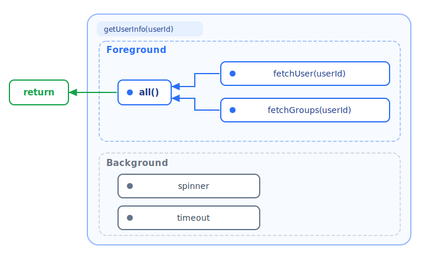

Even in a structurally concurrent system that provides an iron-clad guarantee
that a child task's lifetime will not exceed its parent, there are still gotchas
lurking that can cause wasted resources and unwanted deadlock.

Consider this code that fetches user information and shows a spinner in order to
visually cue the latency:

```javascript
await run(function* getUserInfo(userId) {
  let spinner = yield* spawn(function* () {
    yield* showSpinner({ style: "circle" });
  });

  let [user, groups] = yield* all([fetchUser(userId), fetchGroups(userId)]);

  yield* spinner.halt();

  return { ...user, groups };
});
```

This works by starting the spinner in the background and fetching user
information in parallel. But heads up! It's critical that the spinner stops
spinning before we can return. If it didn't stop, our task would run forever.

Now let's add a timeout to make sure that things don't take too long:

```javascript
await run(function* getUserInfo(userId) {
  let spinner = yield* spawn(function* () {
    yield* showSpinner({ style: "circle" });
  });

  let timeout = yield* spawn(function* () {
    yield* sleep(1000);
    throw new Error(`timeout: took tool long!`);
  });

  let [user, groups] = yield* all([fetchUser(userId), fetchGroups(userId)]);

  yield* timeout.halt();
  yield* spinner.halt();

  return { ...user, groups };
});
```

Alongside the existing flow, this starts a countdown in the background that will
blow up the whole operation if it takes too long. But like the spinner, the
countdown has got to stop, otherwise our task is going to explode.

## Foreground vs Background

By now we can see an interesting dynamic at play. There are actually two
different kinds of operations that we're running. The first type are those that
are evaluated directly in order to produce the result of our computation. In
this case, it is the combination of `fetchUser()`, `fetchGroups()`, and `all()`
which form the _literal definition_ of what it means to `getUserInfo()`. They
are the components used to express the core algorithm which is why we call them
the **foreground**.

Then there are the other tasks: the spinner and the timeout. These don’t
participate in the algorithm, and they don't produce a value on which the return
value depends. Instead they are there to produce a persistent _side-effect_ that
supports the foreground while it runs. That’s what makes them **background**
tasks.

Put simply: if the return value needs it, it's foreground. If it doesn't, it's
background.



Notice how in the code, there is no need to manage the lifecycle of the
foreground tasks. It happens naturally because the foreground requires the
values of all its tasks to be fully computed before it can compute its own
return value. In other words, the lifetime of the foreground is always naturally
aligned with the lifetime of its scope.

On the other hand, the lifetime of a background task is _not_ naturally aligned
with the lifetime of its scope. It could be long, or it could be short. Quite
often, as in the case of our spinner, it could be _infinite_. Whatever the case,
once the foreground is complete, it means that the return value has by
definition been computed and therefore spending _any_ further work on the
background is incorrect and wasteful of resources.

The principle here is that _background work does not have equal structural
standing with foreground work_, and therefore once the foreground is complete, a
correct program must shutdown the background immediately.

## The Teardown Tax

Which brings us back to our example. It is not just that it can be annoying to
have to include lines like these in order to destroy the backround (although it
can be).

```javascript
yield * timeout.halt();
yield * spinner.halt();
```

Rather, it is that _to **not** do so would be **incorrect**_.

The programmer must _**always**_ remember to both identify and teardown the
background in every single task. Otherwise, they will squander resources doing
work that has no bearing on the outcome. Even in cases where the background will
eventually settle, every moment spent beyond the lifetime of the foreground is
wasted.

To forget is at _best_ to introduce an unknown amount of excess work into your
program. At worst, it results in an outright deadlock.

## Where "classic" structured concurrency stops

When Nathaniel Smith
[brought structured concurrency into the
mainstream](https://vorpus.org/blog/notes-on-structured-concurrency-or-go-statement-considered-harmful/)
back in 2018, he argued that, to paraphrase, "a task cannot finish until all of
the child tasks that it created have also finished." If you have not read it, I
highly recommend you stop reading this right now and go have a sit with it.

He shows how within a structurally concurrent system, control flows in to the
top of a scope, and control flows out from the bottom. But in all cases the
ledger of concurrent tasks is exactly the same as when it entered. This simple
constraint is a straight up super-power because it allows us to build and
compose abstractions that can nevertheless contain all kinds of side-effects and
state. The safety is real, and it serves as the bedrock upon which most
structured concurrency implementations rest (Effection icluded).

However, it remains silent on the question of how to handle the interaction
between background and foreground.

```
// pseudocode
with classic {
  scope.start(taskA)  // background, runs for 3 seconds
  scope.start(taskB)  // foreground, runs for 2 seconds
  scope.start(taskC)  // foreground, runs for 1 second
}
// ← unless taskA is stopped, doesn't reach here until all three are done (3 seconds)
```

It's into this gap that Effection doubles down on the program structure as a
means to guarantee program correctness.

## Strict Structured Concurrency

To see this in action, let's revisit the code sample not as it was written
before, but as you would _actually_ write it using idiomatic Effection:

```javascript
await run(function* getUserInfo(userId) {
  yield* spawn(function* () {
    yield* showSpinner({ style: "circle" });
  });

  yield* spawn(function* () {
    yield* sleep(1000);
    throw new Error(`timeout: took tool long!`);
  });

  let [user, groups] = yield* all([fetchUser(userId), fetchGroups(userId)]);

  return { ...user, groups };
});
```

This has the same runtime profile as before, and it has the same properties of
correctness, but the section of code that halts all of the background tasks is
notably missing.

This is because Effection takes care of what is already _known to be needed_ to
ensure program correctness. Namely, that the background goes away as soon as the
foreground is finished computing and it is no longer needed. We call this
additional safety "strict" structured concurrency. It says that _not only_ must
a task not finish until all its children finish, _but also_ that background
tasks are halted once the foreground completes.

One way to think about it is like the memory resources that hold variable
references in a function’s stack frame. When a function exits, those memory
resources are automatically recycled. You don’t have to deallocate them
explicitly; you don’t even have to think about them because the lifetime of the
memory is tied to the function’s scope. Strict structured concurrency does the
same thing for tasks. The background tasks are automatically reclaimed when the
foreground moves on, so that it's one less concern that the programmer has to
carry.

## The guarantees still hold

Strict structured concurrency is still structured concurrency.

When a background task is shut down automatically, it is not terminated
outright. The parent still waits, just as it would under the standard model, for
every child to run _all_ of its cleanup paths. The result computed by the
foreground will not be reported to the caller until they are fully complete.

To demonstrate this, here is an example that starts a task running in the
background, and then promptly finishes.

```javascript
import { main, sleep, spawn } from "effection";

await main(function* () {
  yield* spawn(function* () {
    try {
      yield* sleep(2000);
    } finally {
      yield* sleep(500);
      console.log("cleanup complete");
    }
  });
  console.log("done");
});
```

This will print `“done”` immediately, wait 500 milliseconds, and then print
"cleanup complete" before exiting. This is because upon exit, the background
task will be halted and its `finally {}` block must be run. The strict
refinement doesn't weaken the guarantee, it makes it safer by making orderly
shutdown the _default_ rather than something you have to manage by hand.

## Focus on the algorithm

The deepest consequence of strict structured concurrency is where it focuses
attention. The foreground is in the foreground. The background is allowed to
just _be_ the background. And the structure of your program guarantees that the
latter will gracefully disappear once the former is complete.

Perhaps a more philosophical way to put it: if a concurrent operation computes,
but there is no one there to consume its result, does it actually exist? Under
the guarantees of strict structured concurrency, the answer is no. And the code
you would have written to make it stop? That doesn't need to exist either.
