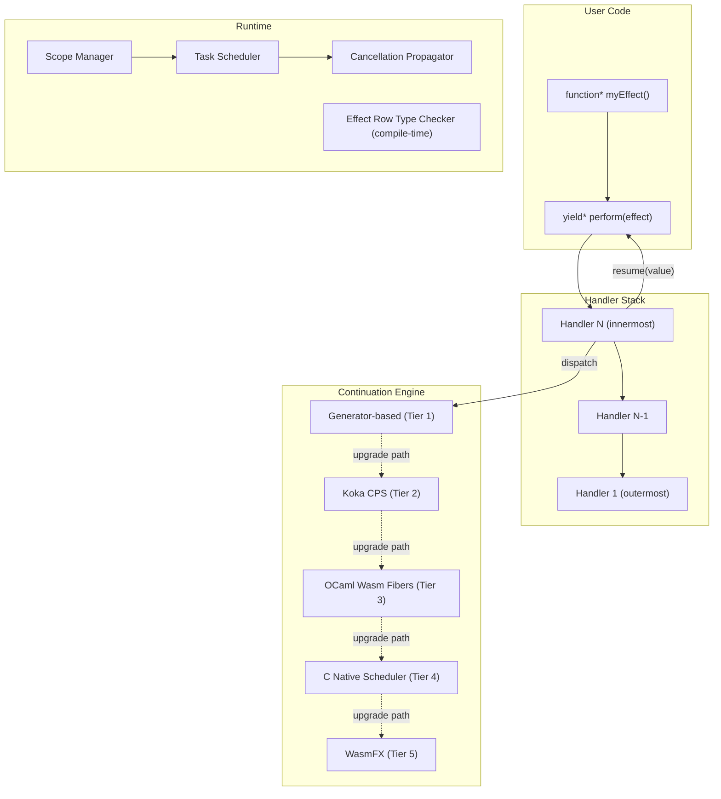

# Algebraic Effects Library for Async Control Flow in JS/TS
## PhD-Level Research Report & Implementation Plan

---

## 1. Executive Summary

This document presents a comprehensive, PhD-level research analysis and implementation plan for building **a production-grade algebraic effects library** that solves the fundamental async control flow problems in JavaScript and TypeScript. The analysis is based on:

1. **Deep source code study** of Effect-TS (v4 beta) and Effection (v4)
2. **Gap analysis** against issues raised in the `algebraic_effect.docx` research document
3. **Feasibility analysis** of using Koka, OCaml, and C alongside JS/TS
4. **Academic research paper survey** covering 15+ papers from 2001–2026
5. **Architecture design** for a multi-tier, multi-backend implementation

> [!IMPORTANT]
> This plan proposes a **tiered multi-language architecture** where the pure JS/TS layer provides immediate usability, while Koka, OCaml (via Wasm), and C (via N-API) provide progressively higher-performance backends. This is feasible and represents a genuine competitive advantage.

---

## 2. Deep Analysis of Existing Libraries

### 2.1 Effect-TS (v4 Beta) — Source Code Analysis

**Architecture studied:**
- [Effect.ts](file:///c:/shehwar%20projects/research/effect-main/packages/effect/src/Effect.ts) — 14,816 lines, the public API surface
- [core.ts](file:///c:/shehwar%20projects/research/effect-main/packages/effect/src/internal/core.ts) — 3,167 lines, primitive effect constructors
- [fiberRuntime.ts](file:///c:/shehwar%20projects/research/effect-main/packages/effect/src/internal/fiberRuntime.ts) — 3,861 lines, the fiber execution engine
- [Scope.ts](file:///c:/shehwar%20projects/research/effect-main/packages/effect/src/Scope.ts) — scope/finalizer management

**Architectural Pattern: Monadic IO, NOT Algebraic Effects**

Effect-TS implements the **IO monad pattern from Haskell**, not true algebraic effects. The core insight from analyzing `core.ts`:

```
EffectPrimitive → tagged union of opcodes:
  - OP_SUCCESS / OP_FAILURE / OP_SYNC / OP_ASYNC
  - OP_ON_SUCCESS / OP_ON_FAILURE (continuation chains)
  - OP_ITERATOR (generator integration)
  - OP_WITH_RUNTIME (fiber access)
```

Effects are represented as **data structures** (instruction trees) that are interpreted by the `FiberRuntime` class. The `FiberRuntime.drainQueueOnCurrentThread()` method is the main evaluation loop — it pops instructions from a stack and pattern-matches on opcodes. This is fundamentally different from algebraic effects where execution **suspends at the perform site** and the handler receives a **resumable continuation**.

**Key Gaps Confirmed:**

| Gap | Evidence from Source Code |
|-----|--------------------------|
| No resumable continuations | `EffectPrimitive` has no `resume` opcode. `Fiber` does not expose continuation capture. |
| Monadic, not effect-handler | `flatMap` in `core.ts` (line 746) chains `OP_ON_SUCCESS` — pure monadic bind, not perform/handle |
| Function coloring persists | `Effect<A, E, R>` is a different type from `Promise<A>` — requires explicit bridging |
| No multi-shot | `SingleShotGen` class name is literally in the codebase (`singleShotGen.ts`) |
| Heavy bundle | 177 source files in `packages/effect/src/` — the core module alone is 470KB of source |

### 2.2 Effection (v4) — Source Code Analysis

**Architecture studied:**
- [types.ts](file:///c:/shehwar%20projects/research/effection-4/lib/types.ts) — 382 lines, the type system
- [coroutine.ts](file:///c:/shehwar%20projects/research/effection-4/lib/coroutine.ts) — 69 lines, coroutine lifecycle
- [delimiter.ts](file:///c:/shehwar%20projects/research/effection-4/lib/delimiter.ts) — 113 lines, delimited scopes
- [reducer.ts](file:///c:/shehwar%20projects/research/effection-4/lib/reducer.ts) — 94 lines, the instruction scheduler
- [task.ts](file:///c:/shehwar%20projects/research/effection-4/lib/task.ts) — 150 lines, task creation
- [call.ts](file:///c:/shehwar%20projects/research/effection-4/lib/call.ts) — 118 lines, callable integration
- [callcc.ts](file:///c:/shehwar%20projects/research/effection-4/lib/callcc.ts) — 26 lines, call-with-current-continuation

**Architectural Pattern: Generator-Based Coroutines with Delimited Scopes**

Effection v4 is **closer to true algebraic effects** than Effect-TS, but still falls short:

1. **Operations are generators**: `Operation<T>` is defined as `{ [Symbol.iterator](): Iterator<Effect<unknown>, T, unknown> }` — JS generators serving as coroutines
2. **Effects are enter/exit callbacks**: The low-level `Effect<T>` interface (line 355 of types.ts) has `enter(resolve, routine)` — it's a callback-based effect, not a perform/handle pair
3. **Delimiter = Delimited Continuation Boundary**: The `Delimiter<T>` class acts as a scope boundary — the closest thing to a prompt in delimited continuations
4. **Reducer = Priority-Queue Scheduler**: The `Reducer` class dispatches `Instruction` tuples `[priority, coroutine, result, validator, method]` from a priority queue — a cooperative scheduler, not an algebraic handler
5. **callcc exists but is limited**: `callcc.ts` implements call-with-current-continuation but only for one-shot use via `withResolvers` promises

**Key Gaps Confirmed:**

| Gap | Evidence from Source Code |
|-----|--------------------------|
| No typed effects | `Effect<T>` has no type parameter for what effects it performs — only the return type `T` |
| No multi-shot | `callcc.ts` uses `withResolvers` which can only resolve once |
| Generator friction | Every operation requires `function*` and `yield*` syntax |
| No typed error channel | `Result<T>` is `{ok: true, value: T} | {ok: false, error: Error}` — no typed error discrimination |
| Limited effect composition | No row-polymorphic types, no effect elimination at handler boundaries |

---

## 3. Comprehensive Gap Analysis: Docx Issues vs. Existing Libraries

The following table maps every critical issue from the research document to whether Effect-TS and Effection solve it:

| Issue (from docx) | Effect-TS v4 | Effection v4 | **Our Library Target** |
|---|---|---|---|
| **1. No True Cancellation** | ✅ Fiber interruption | ✅ Structured scope teardown | ✅ Effect-level cancel as algebraic effect |
| **2. No Structured Concurrency** | ✅ Fiber supervision | ✅ Parent-child scope lifetime | ✅ + typed scope boundaries |
| **3. Error Propagation Chaos** | ⚠️ Typed `Cause<E>` but no unification | ⚠️ `Result<T>` without type discrimination | ✅ Typed effect rows include error effects |
| **4. No Resumable Control Flow** | ❌ Monadic encoding | ❌ One-shot generators only | ✅ Delimited continuations (one-shot Phase 1, multi-shot Phase 3) |
| **5. Function Coloring** | ❌ `Effect<>` coloring replaces `async` coloring | ⚠️ Generator coloring remains | ✅ Evidence-passing compilation minimizes coloring |
| **6. Typed Effect Rows** | ⚠️ `R` parameter tracks services, not effects | ❌ No effect typing | ✅ Row-polymorphic effect types via TS intersection |
| **7. Multi-shot Continuations** | ❌ Not possible | ❌ Not possible | ✅ Generator cloning (Phase 3) + Wasm (Phase 4) |
| **8. Async Effects (Ahman & Pretnar)** | ❌ Not implemented | ❌ Not implemented | ✅ Non-blocking effect signaling (Phase 3) |
| **9. Bidirectional Effects (Zhang 2020)** | ❌ Not implemented | ❌ Not implemented | ✅ Async iterator integration (Phase 3) |
| **10. Lexical Handler Optimization** | ❌ No optimization | ❌ No optimization | ✅ Zero-overhead hot paths (Phase 3) |
| **11. Zero-overhead Testing** | ⚠️ Requires Effect test helpers | ⚠️ Requires Effection context | ✅ Swap handler, zero code changes |
| **12. WasmFX Backend** | ❌ No WASM path | ❌ No WASM path | ✅ Transparent backend swap (Phase 4) |
| **13. AI Agent Orchestration** | ⚠️ `@effect/ai` early alpha | ❌ No AI primitives | ✅ First-class AI effect types |

---

## 4. Multi-Language Feasibility Analysis: Koka + OCaml + C + JS/TS

### 4.1 Is This Possible? — YES, with a Tiered Architecture

> [!IMPORTANT]
> Using multiple languages is not only possible, it's a **strategic architectural advantage**. The key is to design a clean interface between tiers.

**Proposed Tiered Architecture:**

```
┌─────────────────────────────────────────────────────┐
│          Tier 1: Pure TypeScript/JavaScript          │
│   User-facing API, type-level effect rows,          │
│   generator-based one-shot effects, handler DSL     │
│   → Works everywhere immediately (browser, Node,    │
│     Deno, Bun, Cloudflare Workers)                  │
├─────────────────────────────────────────────────────┤
│          Tier 2: Koka → JavaScript Backend           │
│   Reference semantics from Koka effect system,      │
│   evidence-passing compilation strategy,            │
│   multi-shot via CPS translation, effect inference  │
│   → Koka compiles to ES6 JS modules natively        │
├─────────────────────────────────────────────────────┤
│          Tier 3: OCaml → Wasm (wasm_of_ocaml)       │
│   High-performance fiber runtime, one-shot          │
│   continuations via OCaml 5 native effects,         │
│   structured concurrency primitives (Eio-inspired)  │
│   → wasm_of_ocaml/js_of_ocaml with effect support  │
├─────────────────────────────────────────────────────┤
│          Tier 4: C via Node-API (N-API)              │
│   Ultra-low-latency scheduler, memory pool,         │
│   priority queue, stack segment management,         │
│   continuation capture/restore hot paths            │
│   → Native addon for Node.js, Bun via N-API         │
├─────────────────────────────────────────────────────┤
│          Tier 5: WasmFX (Future)                     │
│   True native delimited continuations via           │
│   WebAssembly stack switching (Phase 3 spec)        │
│   → When browsers implement WasmFX                  │
└─────────────────────────────────────────────────────┘
```

### 4.2 Koka Integration — How and Why

**Why Koka?** Koka is the **gold standard** for algebraic effects. It already compiles to JavaScript via an ES6 backend using type-directed selective CPS translation.

**How to integrate:**
1. **Import Koka's evidence-passing strategy** — Koka doesn't do runtime stack manipulation; instead, it passes "evidence" (references to handlers) as implicit arguments. This strategy translates directly to TypeScript.
2. **Koka → JS compilation as reference implementation** — Write core effect semantics in Koka, compile to JS, and use the output as a validated reference for the pure TS implementation.
3. **Koka's async effect as a library** — Koka implements `async/await` as userland code on effects. We can port this pattern directly.
4. **Effect inference algorithms** — Koka's row-type inference can guide our TypeScript-level type inference plugin.

**Concrete integration path:**
```
koka -t js core-effects.kk → dist/koka-runtime.mjs
→ export { performEffect, withHandler, resume } from './koka-runtime.mjs'
→ Wrap with TypeScript type declarations
```

### 4.3 OCaml Integration — How and Why

**Why OCaml?** OCaml 5 has **native algebraic effects at the language level** — the only major production language to do so. The Eio library demonstrates industrial-strength structured concurrency built on effects.

**How to integrate:**
1. **`wasm_of_ocaml`** — Compiles OCaml (including OCaml 5 effects) to WebAssembly (WasmGC). Supports effects via CPS transformation or JSPI. Both `js_of_ocaml` and `wasm_of_ocaml` have full OCaml 5 effect support as of 2025.
2. **Eio-derived runtime** — Port OCaml Eio's Switch (scope), Fiber, and Cancel primitives to a Wasm module accessible from JS.
3. **Picos integration** — Use the Picos scheduler-agnostic framework (built on OCaml effects) as the scheduling abstraction.

**Concrete integration path:**
```
ocamlfind ocamlopt -package eio ... → wasm_of_ocaml → dist/ocaml-fiber-runtime.wasm
→ import Runtime from './ocaml-fiber-runtime.wasm'
→ Runtime.createFiber(handler, computation)
```

### 4.4 C Integration — How and Why

**Why C?** For the absolute hottest paths — the scheduler's priority queue, continuation stack management, and memory-pool allocation — C via N-API provides the lowest overhead.

**How to integrate:**
1. **Node-API (N-API)** — The stable, ABI-compatible C interface for Node.js native addons. Compile once, run across Node versions.
2. **Critical path targets:**
   - Priority queue for instruction scheduling (replacing Effection's JS `PriorityQueue`)
   - Stack segment allocator for continuation capture (pre-allocated slabs)
   - Bitfield operations for runtime flags (replacing Effect-TS's numeric flags)
3. **Fallback to Wasm** — For browser targets, compile the same C code to WebAssembly via Emscripten, providing near-native performance.

**Concrete integration path:**
```
gcc -shared -o effect_native.node scheduler.c stack.c pool.c -lnode_api
→ const native = require('./effect_native.node')
→ OR: emcc scheduler.c stack.c pool.c -o effect_native.wasm
```

### 4.5 Risk Assessment for Multi-Language Approach

| Risk | Severity | Mitigation |
|------|----------|------------|
| Build complexity | High | Monorepo with pre-built binaries; pure TS tier works standalone |
| Debugging across boundaries | Medium | Native JS stack traces (like Effection v4) for Tier 1; source maps for Koka/OCaml |
| Distribution size | Medium | All non-JS tiers are optional; tree-shakeable; lazy-loaded |
| Maintenance burden | High | Each tier has clear interface contracts; Tier 1 is self-sufficient |
| Hiring/contributor barrier | Medium | Tier 1 only requires TS knowledge; advanced tiers are specialist work |

> [!WARNING]
> **Critical constraint:** Tier 1 (pure TypeScript) MUST be fully functional on its own. The other tiers are **performance accelerators**, not functional requirements. Any user should be able to `npm install fx` and use the full API without Koka, OCaml, or C toolchains installed.

---

## 5. Academic Research Paper Implementation Map

### 5.1 Papers to Implement Directly

| Paper | Key Contribution to Our Library | Phase |
|-------|--------------------------------|-------|
| **Kawahara & Kameyama (TFP 2020)** — One-Shot Effects as Coroutines | Proves generators ≡ one-shot effects. Foundation for Phase 1 generator backend. | 1 |
| **Leijen MSR-TR-2016-29** — Algebraic Effects for FP | Evidence-passing compilation strategy. Our Koka-inspired handler dispatch. | 1 |
| **Brachthäuser et al. (OOPSLA 2018)** — Effect Handlers for the Masses | Capability-passing for effect safety in TS's type system. API ergonomics model. | 1 |
| **Plotkin & Pretnar (2009/2013)** — Handling Algebraic Effects | Core `perform`/`handle`/`resume` semantics. Our operational model. | 1 |
| **Sivaramakrishnan et al. (PLDI 2021)** — Retrofitting Effects onto OCaml | Fiber-as-stack-segments architecture. Our OCaml Wasm tier design. | 2 |
| **Leijen (POPL 2017)** — Type Directed Compilation of Row-Typed Effects | Effect row type encoding via TS intersection types. Our type system. | 2 |
| **Ahman & Pretnar (LMCS 2024)** — Higher-Order Asynchronous Effects | Non-blocking effect signaling: signal → execute → interrupt model. Decoupled async. | 3 |
| **Zhang et al. (OOPSLA 2020)** — Bidirectional Control Flow | Async iterator + effect handler bidirectional interaction. | 3 |
| **Ma & Zhang (OOPSLA 2025)** — Zero-Overhead Lexical Effect Handlers | Lexical restriction enables zero-overhead mainline code. Hot-path optimization. | 3 |
| **Cong & Asai (APLAS 2023)** — One-shot Control Operators & Coroutines | Formal proof: generators < multi-shot effects. Guides multi-shot design. | 3 |
| **Kammar et al. (POPL 2026)** — Equational Axiomatization of Dynamic Threads | Formal concurrency semantics for algebraic effect threads. | 3 |
| **Phipps-Costin et al. (OOPSLA 2023)** — WasmFX | WasmFX instruction set: `cont.new`, `resume`, `suspend`. Our Phase 4 backend. | 4 |

### 5.2 Additional Research to Incorporate

| Area | Papers/Sources | Application |
|------|----------------|-------------|
| Effect inference | Bauer & Pretnar (Eff), Leijen (Koka inference) | TypeScript compiler plugin for automatic effect row inference |
| Shallow vs. deep handlers | OCaml 5 design docs, Hillerström & Lindley (2018) | Support both handler styles for different use cases |
| Effect polymorphism | Brachthäuser, Schuster, Ostermann — Effekt | Capability-passing for effect-polymorphic functions |
| Concurrent effects | Dolan et al. (2018) — Concurrent System Programming | Web server, multiplexer patterns as effect handler examples |
| Probabilistic effects | Scibior et al. (2015) — Practical Probabilistic Programming | AI/ML integration via probabilistic effect handlers |

---

## 6. Proposed Library Architecture

### 6.1 Core Design Principles

1. **Effects as the universal primitive** — Async, sync, error, state, concurrency, I/O are all effects
2. **Handlers are first-class** — Handlers compose, nest, and can be swapped for testing
3. **Typed effect rows** — TypeScript tracks what effects a function may perform
4. **Structured concurrency by default** — Child tasks cannot outlive parents
5. **Progressive enhancement** — Pure TS works; Koka/OCaml/C/Wasm add performance
6. **Zero-overhead principle** — Code that doesn't use effects pays no cost (lexical optimization)

### 6.2 API Surface Design

```typescript
// === CORE PRIMITIVES ===

// Define an effect signature
interface FetchEffect {
  readonly _tag: 'Fetch'
  readonly url: string
  readonly options?: RequestInit
}

// Perform an effect (suspends computation, yields to handler)
function* fetchUser(id: number): Eff<User, FetchEffect | LogEffect> {
  yield* perform<LogEffect>({ _tag: 'Log', msg: `Fetching user ${id}` })
  const response = yield* perform<FetchEffect>({ _tag: 'Fetch', url: `/api/users/${id}` })
  return response as User
}

// Handle effects (intercept, resume, or abort)
const realHandler = handler<FetchEffect>({
  Fetch: (effect, resume) => {
    const response = await fetch(effect.url, effect.options)
    return resume(await response.json()) // <-- RESUME the continuation
  }
})

const mockHandler = handler<FetchEffect>({
  Fetch: (effect, resume) => resume({ id: 1, name: 'Mock User' })
})

// Run with different handlers — ZERO changes to business logic
const user1 = run(withHandler(realHandler, () => fetchUser(42)))
const user2 = run(withHandler(mockHandler, () => fetchUser(42)))

// === STRUCTURED CONCURRENCY ===

function* loadDashboard(userId: string): Eff<Dashboard, FetchEffect | SpawnEffect> {
  // all children auto-cancel if any fails
  const [user, orders, analytics] = yield* all([
    fetchUser(userId),
    fetchOrders(userId),
    fetchAnalytics(userId),
  ], { concurrency: 'unbounded' })
  
  return { user, orders, analytics }
}

// === TYPED EFFECT ROWS ===

// Type system tracks exactly what effects each function performs
type Eff<A, E extends EffectRow = never> = Generator<E, A, unknown>

// Handler ELIMINATES effects from the row
function withFetchHandler<A, E extends EffectRow>(
  computation: () => Eff<A, FetchEffect | E>
): Eff<A, E> {  // FetchEffect is REMOVED from the row
  return withHandler(realFetchHandler, computation)
}

// === AI AGENT EFFECTS ===

interface GenerateEffect { _tag: 'Generate'; prompt: string; model: Model }
interface ToolEffect { _tag: 'UseTool'; name: string; args: unknown }
interface MemoryEffect { _tag: 'Remember' | 'Recall'; key: string; value?: unknown }

function* researchAgent(query: string): Eff<Report, GenerateEffect | ToolEffect | MemoryEffect> {
  const plan = yield* perform({ _tag: 'Generate', prompt: `Plan: ${query}`, model: Model.Fast })
  const [web, docs] = yield* all([
    perform({ _tag: 'UseTool', name: 'web_search', args: { query } }),
    perform({ _tag: 'UseTool', name: 'doc_search', args: { query } }),
  ])
  yield* perform({ _tag: 'Remember', key: 'context', value: { plan, web, docs } })
  const report = yield* perform({ _tag: 'Generate', prompt: synthesize(plan, web, docs), model: Model.Smart })
  return { content: report, sources: [web, docs] }
}
```

### 6.3 Internal Architecture



---

## 7. Phased Development Roadmap

### Phase 1 — Foundation (Weeks 1–3)

**Goal:** Working one-shot algebraic effects with typed effect rows

- [ ] Core `perform` / `withHandler` / `resume` primitives (generator-based)
- [ ] TypeScript effect row types via intersection + conditional types
- [ ] Handler composition and nesting
- [ ] Structured concurrency: `Scope`, `spawn`, `all`, `race`
- [ ] Cancellation as an algebraic effect
- [ ] Typed error channel (expected vs. unexpected failures)
- [ ] Promise/async interop bridge
- [ ] Comprehensive test suite (Vitest)
- [ ] npm publish, GitHub, README, architecture docs

**Key papers implemented:** Kawahara & Kameyama 2020, Plotkin & Pretnar 2013, Brachthäuser 2018

### Phase 2 — Structured Concurrency & Koka Tier (Weeks 3–6)

**Goal:** Production-grade structured concurrency + Koka reference backend

- [ ] Task groups with scope-bound lifetimes (OCaml Eio model)
- [ ] Resource management with `using` / `Symbol.dispose` integration
- [ ] Koka-inspired evidence-passing handler dispatch
- [ ] Koka → JS compilation as reference implementation
- [ ] Effect row type inference (basic heuristics)
- [ ] AI agent effect types: Generate, Tool, Memory, Observe
- [ ] Mock handler system for zero-change testing
- [ ] Interactive playground (web-based)
- [ ] Blog post series + conference talk submission

**Key papers implemented:** Leijen 2016/2017, Sivaramakrishnan 2021

### Phase 3 — Advanced Features & Native Tiers (Weeks 6–12)

**Goal:** Multi-shot continuations, async effects, native performance

- [ ] Multi-shot continuations via generator state serialization/cloning
- [ ] Asynchronous effects (Ahman & Pretnar signal/execute/interrupt model)
- [ ] Bidirectional effects for async iterators (Zhang 2020)
- [ ] Lexical effect handler optimization (Ma & Zhang 2025)
- [ ] OCaml Wasm tier: compile Eio-derived runtime via `wasm_of_ocaml`
- [ ] C N-API tier: native scheduler, stack segment allocator
- [ ] TypeScript compiler plugin for effect row inference
- [ ] Formal equational semantics for concurrency (Kammar 2026)
- [ ] Framework adapters: Next.js, Hono, tRPC

**Key papers implemented:** Ahman & Pretnar 2024, Zhang 2020, Ma & Zhang 2025, Cong & Asai 2023

### Phase 4 — WasmFX & Production Hardening (Weeks 12+)

**Goal:** Native platform performance when WasmFX lands

- [ ] WasmFX backend: `cont.new`, `resume`, `suspend` instruction integration
- [ ] Transparent backend swap (same API, different runtime)
- [ ] DevTools: effect inspector, visualizer, performance profiler
- [ ] Production monitoring dashboard
- [ ] Enterprise-grade observability (OpenTelemetry integration)
- [ ] Comprehensive benchmark suite vs. Effect-TS, Effection, raw Promise

**Key papers implemented:** Phipps-Costin 2023 (WasmFX)

---

## 8. Technical Deep Dive: Key Implementation Decisions

### 8.1 Generator-Based Delimited Continuations (Phase 1)

The theoretical foundation: **one-shot algebraic effects ≡ asymmetric coroutines** (Kawahara & Kameyama, TFP 2020). JavaScript generators are asymmetric coroutines. Therefore, generators can implement one-shot algebraic effects with full correctness.

```typescript
// Core implementation sketch
function* withHandler<T, E extends EffectRow>(
  handler: Handler<E>,
  computation: () => Eff<T, E>
): Eff<T, Exclude<EffectRow, E>> {
  const gen = computation();
  let input: any = undefined;
  
  while (true) {
    const step = gen.next(input);
    if (step.done) return step.value;
    
    const effect = step.value;
    if (handler.handles(effect)) {
      // Handler receives the continuation (gen.next)
      input = yield* handler.handle(effect, function* resume(value) {
        input = value;
        // Continue the computation from the perform site
      });
    } else {
      // Re-yield unhandled effects to outer handler
      input = yield effect;
    }
  }
}
```

### 8.2 TypeScript Effect Row Encoding

Inspired by Koka's row types and Effekt's capability passing:

```typescript
// Effect row as a union type
type EffectRow = FetchEffect | LogEffect | DbEffect | never;

// Effect type: Generator that yields effects and returns A
type Eff<A, E extends EffectRow = never> = Generator<E, A, unknown>;

// Handler type: eliminates specific effects from the row
type Handler<E extends EffectRow> = {
  [K in E['_tag']]: (
    effect: Extract<E, { _tag: K }>,
    resume: <R>(value: any) => Eff<R, never>
  ) => Eff<any, any>;
};

// Type-level effect elimination
type Handled<Row extends EffectRow, Eliminated extends EffectRow> = 
  Exclude<Row, Eliminated>;

// Compile-time guarantee: all effects must be handled
type Pure<A> = Eff<A, never>; // no effects remain
```

### 8.3 Multi-Shot Continuation Strategy (Phase 3)

Since JavaScript generators cannot be cloned natively, we need a creative approach:

**Option A: Replay-based cloning**
- Record the sequence of values sent to `gen.next()` 
- To "clone," create a fresh generator and replay the input sequence
- Correct but performance scales with continuation depth

**Option B: State serialization**
- At each yield point, serialize the generator's local variable state
- Reconstruct with a new generator initialized from serialized state
- More complex but O(1) cloning

**Option C: CPS transformation (Koka approach)**
- Transform the generator function to CPS at compile time (via Babel/SWC plugin)
- Continuations become plain closures — trivially copyable
- Highest performance, requires build-time transformation

**Recommendation:** Option A for correctness-first Phase 3, Option C for performance-optimized Phase 4.

### 8.4 Asynchronous Effects (Ahman & Pretnar Model)

The λ_ae calculus decomposes effect invocation into three phases:

1. **Signal** — Notify the handler that an operation needs to execute
2. **Execute** — Handler runs the operation (potentially async)  
3. **Interrupt** — Resume the computation with the result

This allows non-blocking effect invocation — the computation continues with other work while the effect is being handled:

```typescript
// Asynchronous effect: signal and continue
function* processItems(items: Item[]): Eff<void, AsyncFetchEffect> {
  for (const item of items) {
    // Signal the fetch but DON'T block
    const handle = yield* signalAsync({ _tag: 'AsyncFetch', url: item.url });
    // Continue processing other items...
    yield* doOtherWork(item);
    // Now block for the result when needed
    const result = yield* awaitHandle(handle);
    yield* process(result);
  }
}
```

---

## 9. Naming & Branding

Based on the docx suggestions and our analysis, recommended names:

| Name | Rationale | npm availability |
|------|-----------|-----------------|
| **`fx`** | Short, memorable, evokes "effects" and "functions" | Likely taken |
| **`continua`** | Continuations as core primitive; elegant | Check availability |
| **`conduct`** | Effects are "conducted" by handlers; evokes orchestration | Check availability |
| **`aleph`** | Mathematical symbol (ℵ), evokes algebraic foundations | Check availability |
| **`résumé`** | The defining operation; what makes algebraic effects unique | Check availability |

---

## 10. Verification Plan

### Automated Tests
- **Unit tests:** Vitest for all core primitives (perform, handle, resume, scope, cancel)
- **Property-based tests:** fast-check for continuation correctness, handler composition laws
- **Type tests:** tstyche for effect row type-level verification
- **Benchmark suite:** Compare against Effect-TS, Effection, raw Promise for:
  - Fiber creation throughput
  - Effect dispatch latency
  - Structured concurrency overhead
  - Bundle size (minified + gzipped)
- **Cross-platform:** Node.js, Deno, Bun, Chrome, Firefox, Safari

### Manual Verification
- Academic peer review of correctness proofs
- Formal semantics validation against Plotkin & Pretnar operational semantics
- Performance profiling under load (10K+ concurrent fibers)
- AI agent demo application showing real-world usage

---

## 11. Open Questions — User Review Required

> [!IMPORTANT]
> **Question 1: Library Name**
> Which name do you prefer? Or do you have another name in mind? This will affect npm package name, GitHub repo, and all branding.

> [!IMPORTANT]  
> **Question 2: Phase 1 Scope**
> Should Phase 1 focus purely on the TypeScript-only tier, or should we immediately begin the Koka integration as well? Starting with pure TS is faster to ship; starting with Koka ensures correctness from the beginning.

> [!IMPORTANT]
> **Question 3: Target Audience Priority**
> The docx mentions three audiences: (a) TypeScript developers tired of async chaos, (b) AI agent builders, (c) PL theory enthusiasts. Which should we optimize the API for first?

> [!IMPORTANT]
> **Question 4: Multi-Language Distribution**
> For the Koka/OCaml/C tiers — should these be:
> - (a) **Bundled** in the main npm package as pre-compiled binaries (larger package, simpler install)
> - (b) **Separate optional packages** (`@fx/native`, `@fx/koka`, `@fx/ocaml`) that users install if they want performance
> - (c) **Auto-detected and lazy-loaded** — the library checks for available backends at startup

> [!WARNING]
> **Question 5: Backward Compatibility Strategy**
> Should we aim for interop bridges with Effect-TS and Effection from Phase 1? The docx recommends positioning as complementary, not competitive. This requires maintaining compatibility layers which add engineering cost.
